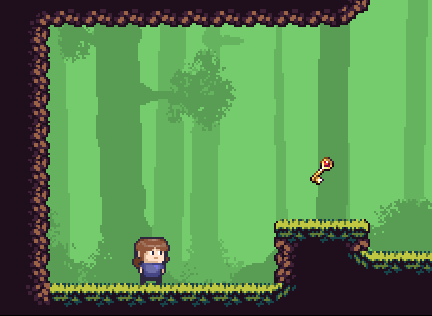
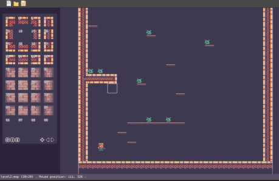

# Pig's Castle Game

[](https://github.com/tarcisiofischer/pigs_game/actions/workflows/cmake.yml)

A small 2D sidescroller game written in C++ with SDL2.




## Map editor

A WYSIWYG map editor is provided for level design. It is fully developed over
SDL, so no extra dependencies are required.




## How to build

Make sure you have SDL installed. For example, in Ubuntu systems:

```
apt install libsdl2-dev libsdl2-image-dev libsdl2-mixer-dev libsdl2-ttf-dev
```

Building and running (with CMake):

```
# Build
mkdir build/ && cd build/
cmake ..
cmake --build .

# Run
cd bin/
./PigsGame
```

## Special thanks
- [Pixel Frog](https://twitter.com/_pixelfrog): Some Pixel art (background and characters)
- [Sérgio](https://github.com/sergiogibe/): Background music & many cool suggestions
- [Void1](https://www.void1gaming.com/): Some of the sound effects
